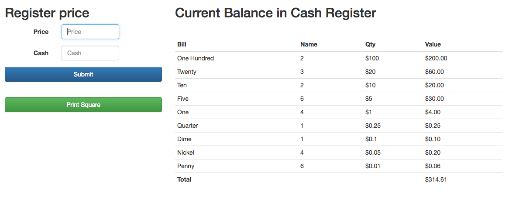
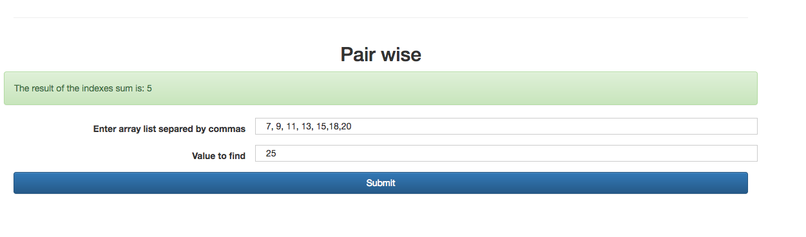

# Senior tech test GFT

## Requirements

1. Design a CashRegister  that allows you to make payment by passing “price”, “cash” and then calculates if the change due is available, if the amount is available then return “Change Due: $1.01” if it does not have sufficient cash then return “Insufficient Funds” and after paid is trigger then it returns “Closed”. Also you should be able to call square at the end of day, initial cash + sold amount it should equal totalAmount available.

_**Note** remember the cash register should know how many of each amount it contains, and it could use combinations of each to give you the change._

```
Example:
[["PENNY", 0.01], ["NICKEL", 0], ["DIME", 0], ["QUARTER", 0], ["ONE", 1.00], ["FIVE", 0], ["TEN", 0], ["TWENTY", 0], ["ONE HUNDRED", 0]] It always has all 9 denominations, even when they are 0.
```

2. Given an array arr, find element pairs whose sum equal the second argument arg and return the sum of their indices.
If multiple pairs are possible that have the same numeric elements but different indices, return the smallest sum of indices. Once an element has been used, it cannot be reused to pair with another.

For example pairWise([7, 9, 11, 13, 15], 20) returns 6. The pairs that sum to 20 are [7, 13] and [9, 11]. We can then write out the array with their indices and values.
```
Index	0	1	2	3	4
Value	7	9	11	13	15
```
**Below we'll take their corresponding indices and add them.**
```
7 + 13 = 20 → Indices 0 + 3 = 3
9 + 11 = 20 → Indices 1 + 2 = 3
3 + 3 = 6 → Return 6
```

## UI Screenshot




## Features
### Register Cash
- It randomizes the bills in cash on every page loads.
- Displays the values in a table with the current bills in the register cash.
- Use Bootstrap to display the template
- Updates and reduces the bills on every cash change.

### Pair Wise

- For Pair Wise algorithm check `/js/PairWise.js`
- Adding array as a comma separated value in an input
- Calculates and display in screen as a alert


